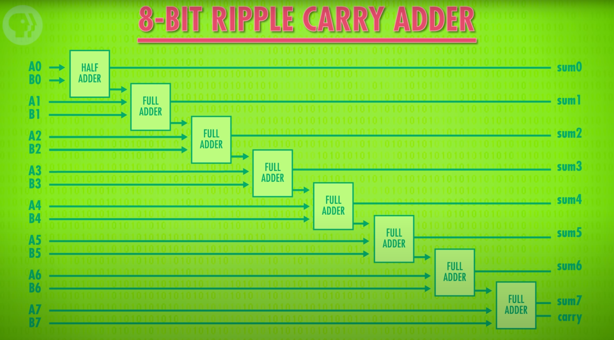

# Simulated 8-bit Adder in TypeScript

Personal experiment to practice TypeScript.

Inspired by [Crash Course's ALU-video](https://youtu.be/1I5ZMmrOfnA).

---

[](https://youtu.be/1I5ZMmrOfnA)

<p align="center"><small><i>Diagram from video describing inner workings</i></small></p>

---

```ts
// WIP (exists in repo `algorithms`)
```
